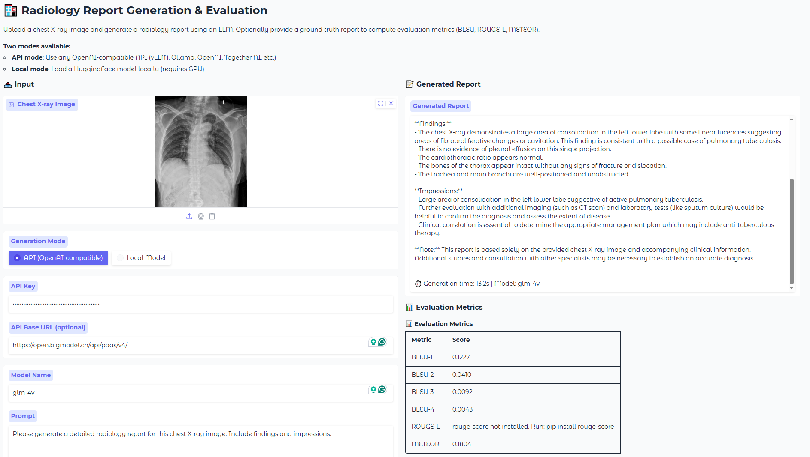

# LLM-based Radiology Report Generation & Evaluation Toolkit

A toolkit for generating radiology reports from chest X-ray images using Large Language Models (LLMs), and evaluating the generated reports with multiple clinical and NLG metrics.

While we provide out-of-the-box support for Qwen series models (Qwen2.5-VL, Qwen3-VL, Qwen3.5), the evaluation pipeline is **model-agnostic** — any LLM-generated reports in the supported JSON format can be evaluated.

> 📊 **[Jump to Experimental Results ↓](#-experimental-results)**

## 📁 Project Structure

```
.
├── app.py                         # 🌐 Web demo (Gradio-based UI)
├── qwen_report_generation.py      # Qwen VL inference for report generation
├── evaluate_chexbert.py           # CheXbert-based clinical accuracy evaluation
├── evaluate_nlg.py                # NLG metrics (BLEU, ROUGE, METEOR, BERTScore, etc.)
├── evaluate_llm_as_labeler.py     # LLM-as-labeler clinical accuracy evaluation
├── CheXbert/                      # CheXbert label extraction module
│   └── src/
│       ├── label.py
│       ├── constants.py
│       ├── utils.py
│       ├── bert_tokenizer.py
│       ├── models/
│       │   └── bert_labeler.py
│       └── datasets_chexbert/
│           └── unlabeled_dataset.py
├── requirements.txt
└── README.md
```

## 🚀 Installation

```bash
pip install -r requirements.txt

# For the web demo
pip install gradio openai
```

For optional clinical metrics:
```bash
# RadGraph F1 (requires model download)
pip install radgraph

# RaTEScore
pip install ratescore
```

## 📋 Prerequisites

### Data Format

**Input dataset** (`test_dataset.json`):
```json
{
  "test": [
    {
      "id": "sample_001",
      "role": "user",
      "content": [
        {"type": "image", "image": "/path/to/chest_xray.jpg"},
        {"type": "text", "text": "Please generate a radiology report for this chest X-ray."}
      ]
    }
  ]
}
```

**Annotation file** (`annotation.json`) for evaluation:
```json
{
  "test": [
    {
      "id": "sample_001",
      "report": "No acute cardiopulmonary abnormality. The heart size is normal..."
    }
  ]
}
```

### CheXbert Checkpoint

Download the CheXbert checkpoint from:
- https://stanfordmedicine.app.box.com/s/c3stck6w6dol3h36grdc97xoydzxd7w9

Place it at `./checkpoints/chexbert.pth` (or specify via `--chexbert_checkpoint`).

## 🌐 Web Demo

A simple web interface for single-image report generation and evaluation:



```bash
pip install gradio openai
python app.py
```

Then open `http://localhost:7860` in your browser.

**Features:**
- Upload a chest X-ray image and generate a report instantly
- **API mode**: Use any OpenAI-compatible API (OpenAI, vLLM, Ollama, Together AI, etc.)
- **Local mode**: Load a HuggingFace model locally (requires GPU)
- Optionally paste a ground truth report to compute metrics (BLEU, ROUGE-L, METEOR)

**Options:**
```bash
python app.py --port 7860 --share  # Create a public Gradio link
python app.py --server_name 127.0.0.1  # Localhost only
```

**Supported API providers:**
| Provider | API Base URL |
|----------|-------------|
| OpenAI | (leave empty, uses default) |
| vLLM (local) | `http://localhost:8000/v1` |
| Ollama | `http://localhost:11434/v1` |
| Together AI | `https://api.together.xyz/v1` |
| Any OpenAI-compatible | Your endpoint URL |

---

## 📖 Usage (Batch / Command Line)

### 1. Report Generation

Generate radiology reports from chest X-ray images using Qwen VL models:

```bash
# Using Qwen2.5-VL-7B (default)
python qwen_report_generation.py \
    --model_name Qwen/Qwen2.5-VL-7B-Instruct \
    --question_file ./data/test_dataset.json \
    --output_file ./results/qwen_output.json \
    --max_tokens 512

# Using Qwen3-VL-8B
python qwen_report_generation.py \
    --model_name Qwen/Qwen3-VL-8B-Instruct \
    --model_type qwen3vl \
    --question_file ./data/test_dataset.json \
    --output_file ./results/qwen3vl_output.json \
    --max_tokens 512

# With thinking mode (Qwen3.5)
python qwen_report_generation.py \
    --model_name Qwen/Qwen3.5-27B \
    --question_file ./data/test_dataset.json \
    --output_file ./results/qwen35_output.json \
    --max_tokens 4096 \
    --enable_thinking

# Resume from interrupted run
python qwen_report_generation.py \
    --model_name Qwen/Qwen2.5-VL-7B-Instruct \
    --question_file ./data/test_dataset.json \
    --output_file ./results/qwen_output.json \
    --resume
```

**Key arguments:**
| Argument | Description | Default |
|----------|-------------|---------|
| `--model_name` | HuggingFace model name or local path | `Qwen/Qwen2.5-VL-7B-Instruct` |
| `--model_type` | `auto` or `qwen3vl` | `auto` |
| `--max_tokens` | Max new tokens to generate | `2048` |
| `--enable_thinking` | Enable thinking mode (Qwen3.5) | `False` |
| `--flash_attn` | Use Flash Attention 2 | `False` |
| `--resume` | Resume from existing output | `False` |

### 2. CheXbert Evaluation

Evaluate clinical accuracy using CheXbert label extraction:

```bash
python evaluate_chexbert.py \
    --llm_output ./results/qwen_output.json \
    --annotation_json ./data/annotation.json \
    --chexbert_checkpoint ./checkpoints/chexbert.pth \
    --output_dir ./results/chexbert_eval
```

**Output:**
- `*_eval_summary.xlsx` — Per-disease AUC, F1, Recall, Specificity + macro average
- `*_per_sample.csv` — Per-sample binary predictions and agreements

### 3. NLG Metrics Evaluation

Evaluate with BLEU, ROUGE-L, METEOR, BERTScore, RadGraph F1, RaTEScore:

```bash
# Basic NLG metrics (fast, no GPU needed for BLEU/ROUGE/METEOR)
python evaluate_nlg.py \
    --llm_output ./results/qwen_output.json \
    --annotation_json ./data/annotation.json \
    --output_dir ./results/nlg_eval \
    --metrics bleu,rouge,meteor

# All metrics including BERTScore (needs GPU)
python evaluate_nlg.py \
    --llm_output ./results/qwen_output.json \
    --annotation_json ./data/annotation.json \
    --output_dir ./results/nlg_eval \
    --metrics bleu,rouge,meteor,bertscore

# Full evaluation with clinical metrics
python evaluate_nlg.py \
    --llm_output ./results/qwen_output.json \
    --annotation_json ./data/annotation.json \
    --output_dir ./results/nlg_eval \
    --metrics bleu,rouge,meteor,bertscore,radgraph,ratescore
```

**Available metrics:**
| Metric | Package | GPU Required |
|--------|---------|:---:|
| BLEU-1/2/3/4 | nltk | ❌ |
| ROUGE-L | rouge-score | ❌ |
| METEOR | nltk | ❌ |
| BERTScore | bert-score | ✅ |
| RadGraph F1 | radgraph | ✅ |
| RaTEScore | ratescore | ✅ |

### 4. LLM-as-Labeler Evaluation

Use another LLM as a label extractor (alternative to CheXbert):

```bash
python evaluate_llm_as_labeler.py \
    --llm_output ./results/qwen_output.json \
    --annotation_json ./data/annotation.json \
    --labeler_model Qwen/Qwen2.5-7B-Instruct \
    --output_dir ./results/llm_labeler_eval
```

**Features:**
- Persistent GT cache: ground truth reports are labeled only once per labeler model
- Resume support: interrupted runs can be continued
- Both prediction and GT reports are labeled by the same LLM for fair comparison

## 📊 Output Format

The report generation script outputs:
```json
{
  "test": [
    {
      "id": "sample_001",
      "output": "The heart size is normal. The lungs are clear..."
    },
    {
      "id": "sample_002",
      "output": "There is mild cardiomegaly. Small bilateral pleural effusions..."
    }
  ]
}
```

## 📈 Experimental Results

Below are our evaluation results comparing different models on the MIMIC-CXR test set.

### CheXbert as Labeler

<table>
<tr>
<th rowspan="2">Disease</th>
<th colspan="4" align="center">Qwen3.5-27B</th>
<th colspan="4" align="center">Qwen3-VL-8B</th>
</tr>
<tr>
<th>AUC</th><th>F1</th><th>Recall</th><th>Spec</th>
<th>AUC</th><th>F1</th><th>Recall</th><th>Spec</th>
</tr>
<tr><td>Enlarged Cardiomediastinum</td><td>0.4955</td><td>0.1097</td><td>0.1921</td><td>0.7988</td><td>0.4758</td><td>0.1303</td><td>0.5424</td><td>0.4092</td></tr>
<tr><td>Cardiomegaly</td><td>0.6989</td><td>0.6551</td><td>0.9193</td><td>0.4784</td><td>0.5827</td><td>0.5703</td><td>0.8924</td><td>0.273</td></tr>
<tr><td>Lung Opacity</td><td>0.5988</td><td>0.5238</td><td>0.5643</td><td>0.6332</td><td>0.5772</td><td>0.5359</td><td>0.0694</td><td>0.485</td></tr>
<tr><td>Lung Lesion</td><td>0.5072</td><td>0.0482</td><td>0.0317</td><td>0.9827</td><td>0.5001</td><td>0.0337</td><td>0.0238</td><td>0.9765</td></tr>
<tr><td>Edema</td><td>0.6842</td><td>0.4471</td><td>0.6485</td><td>0.7198</td><td>0.5624</td><td>0.3115</td><td>0.4653</td><td>0.6595</td></tr>
<tr><td>Consolidation</td><td>0.5145</td><td>0.0671</td><td>0.0485</td><td>0.9805</td><td>0.5141</td><td>0.0797</td><td>0.1165</td><td>0.9117</td></tr>
<tr><td>Pneumonia</td><td>0.5529</td><td>0.1505</td><td>0.1400</td><td>0.9659</td><td>0.5074</td><td>0.0354</td><td>0.02</td><td>0.9948</td></tr>
<tr><td>Atelectasis</td><td>0.5513</td><td>0.2854</td><td>0.2153</td><td>0.8873</td><td>0.5008</td><td>0.0128</td><td>0.0065</td><td>0.995</td></tr>
<tr><td>Pneumothorax</td><td>0.6280</td><td>0.3171</td><td>0.2653</td><td>0.9907</td><td>0.5081</td><td>0.0339</td><td>0.0204</td><td>0.9958</td></tr>
<tr><td>Pleural Effusion</td><td>0.7105</td><td>0.6190</td><td>0.6190</td><td>0.8019</td><td>0.5505</td><td>0.2796</td><td>0.1905</td><td>0.9106</td></tr>
<tr><td>Pleural Other</td><td>0.5142</td><td>0.0556</td><td>0.0294</td><td>0.9991</td><td>0.4958</td><td>0</td><td>0</td><td>0.9916</td></tr>
<tr><td>Fracture</td><td>0.4995</td><td>0.0000</td><td>0.0000</td><td>0.9990</td><td>0.499</td><td>0</td><td>0</td><td>0.9981</td></tr>
<tr><td>Support Devices</td><td>0.6783</td><td>0.5688</td><td>0.4547</td><td>0.9019</td><td>0.645</td><td>0.5574</td><td>0.5128</td><td>0.7772</td></tr>
<tr><td>No Finding</td><td>0.6520</td><td>0.2557</td><td>0.4242</td><td>0.8797</td><td>0.5023</td><td>0.0144</td><td>0.0076</td><td>0.9971</td></tr>
<tr><td><b>Macro Average</b></td><td><b>0.5918</b></td><td><b>0.2931</b></td><td><b>0.3252</b></td><td><b>0.8585</b></td><td><b>0.5301</b></td><td><b>0.1854</b></td><td><b>0.2477</b></td><td><b>0.8125</b></td></tr>
</table>

### Qwen3.5 as Labeler

<table>
<tr>
<th rowspan="2">Disease</th>
<th colspan="4" align="center">Qwen3.5-27B</th>
<th colspan="4" align="center">Qwen3-VL-8B</th>
</tr>
<tr>
<th>AUC</th><th>F1</th><th>Recall</th><th>Spec</th>
<th>AUC</th><th>F1</th><th>Recall</th><th>Spec</th>
</tr>
<tr><td>Enlarged Cardiomediastinum</td><td>0.6108</td><td>0.3622</td><td>0.6525</td><td>0.5691</td><td>0.5487</td><td>0.3088</td><td>0.5875</td><td>0.5099</td></tr>
<tr><td>Cardiomegaly</td><td>0.7090</td><td>0.6466</td><td>0.9278</td><td>0.4902</td><td>0.5925</td><td>0.5561</td><td>0.8789</td><td>0.3061</td></tr>
<tr><td>Lung Opacity</td><td>0.6253</td><td>0.5931</td><td>0.6915</td><td>0.5592</td><td>0.5938</td><td>0.5899</td><td>0.7758</td><td>0.4118</td></tr>
<tr><td>Lung Lesion</td><td>0.5288</td><td>0.1085</td><td>0.0619</td><td>0.9957</td><td>0.4950</td><td>0.0000</td><td>0.0000</td><td>0.9900</td></tr>
<tr><td>Edema</td><td>0.7031</td><td>0.5464</td><td>0.6577</td><td>0.7486</td><td>0.5773</td><td>0.3986</td><td>0.5207</td><td>0.6338</td></tr>
<tr><td>Consolidation</td><td>0.5263</td><td>0.0990</td><td>0.0926</td><td>0.9600</td><td>0.5049</td><td>0.0721</td><td>0.1111</td><td>0.8987</td></tr>
<tr><td>Pneumonia</td><td>0.5689</td><td>0.1200</td><td>0.1800</td><td>0.9579</td><td>0.5012</td><td>0.0225</td><td>0.0200</td><td>0.9824</td></tr>
<tr><td>Atelectasis</td><td>0.5547</td><td>0.3080</td><td>0.2324</td><td>0.8771</td><td>0.5046</td><td>0.0446</td><td>0.0235</td><td>0.9856</td></tr>
<tr><td>Pneumothorax</td><td>0.6533</td><td>0.3373</td><td>0.3182</td><td>0.9885</td><td>0.4979</td><td>0</td><td>0.0000</td><td>0.9958</td></tr>
<tr><td>Pleural Effusion</td><td>0.7217</td><td>0.6276</td><td>0.6293</td><td>0.8141</td><td>0.5635</td><td>0.3197</td><td>0.2298</td><td>0.8972</td></tr>
<tr><td>Pleural Other</td><td>0.5123</td><td>0.0482</td><td>0.0250</td><td>0.9995</td><td>0.5085</td><td>0.0404</td><td>0.0250</td><td>0.9920</td></tr>
<tr><td>Fracture</td><td>0.4998</td><td>0.0000</td><td>0.0000</td><td>0.9995</td><td>0.5000</td><td>0.0000</td><td>0.0000</td><td>1.0000</td></tr>
<tr><td>Support Devices</td><td>0.7365</td><td>0.8042</td><td>0.8640</td><td>0.6090</td><td>0.6835</td><td>0.7376</td><td>0.7451</td><td>0.6219</td></tr>
<tr><td>No Finding</td><td>0.8213</td><td>0.2918</td><td>0.8571</td><td>0.7855</td><td>0.7823</td><td>0.3162</td><td>0.7143</td><td>0.8503</td></tr>
<tr><td><b>Macro Average</b></td><td><b>0.6266</b></td><td><b>0.3495</b></td><td><b>0.4421</b></td><td><b>0.8110</b></td><td><b>0.5610</b></td><td><b>0.2433</b></td><td><b>0.3308</b></td><td><b>0.7911</b></td></tr>
</table>

### Difference (Qwen3.5 as Labeler − CheXbert as Labeler)

<table>
<tr>
<th rowspan="2">Disease</th>
<th colspan="4" align="center">Qwen3.5-27B</th>
<th colspan="4" align="center">Qwen3-VL-8B</th>
</tr>
<tr>
<th>ΔAUC</th><th>ΔF1</th><th>ΔRecall</th><th>ΔSpec</th>
<th>ΔAUC</th><th>ΔF1</th><th>ΔRecall</th><th>ΔSpec</th>
</tr>
<tr><td>Enlarged Cardiomediastinum</td><td>0.1153</td><td>0.2525</td><td><b>0.4604</b></td><td>−0.2297</td><td>0.0729</td><td>0.1785</td><td>0.0451</td><td>0.1007</td></tr>
<tr><td>Cardiomegaly</td><td>0.0101</td><td>−0.0085</td><td>0.0085</td><td>0.0118</td><td>0.0098</td><td>−0.0142</td><td>−0.0135</td><td>0.0331</td></tr>
<tr><td>Lung Opacity</td><td>0.0265</td><td>0.0693</td><td><b>0.1272</b></td><td>−0.0740</td><td>0.0166</td><td>0.0540</td><td>0.1064</td><td>−0.0732</td></tr>
<tr><td>Lung Lesion</td><td>0.0216</td><td>0.0603</td><td>0.0302</td><td>0.0130</td><td>−0.0051</td><td>−0.0337</td><td>−0.0238</td><td>0.0135</td></tr>
<tr><td>Edema</td><td>0.0189</td><td>0.0993</td><td>0.0092</td><td>0.0288</td><td>0.0149</td><td>0.0871</td><td>0.0554</td><td>−0.0257</td></tr>
<tr><td>Consolidation</td><td>0.0118</td><td>0.0319</td><td>0.0441</td><td>−0.0205</td><td>−0.0092</td><td>−0.0076</td><td>−0.0054</td><td>−0.0130</td></tr>
<tr><td>Pneumonia</td><td>0.0160</td><td>−0.0305</td><td>0.0400</td><td>−0.0080</td><td>−0.0062</td><td>−0.0129</td><td>0.0000</td><td>−0.0124</td></tr>
<tr><td>Atelectasis</td><td>0.0034</td><td>0.0226</td><td>0.0171</td><td>−0.0102</td><td>0.0038</td><td>0.0318</td><td>0.0170</td><td>−0.0094</td></tr>
<tr><td>Pneumothorax</td><td>0.0253</td><td>0.0202</td><td>0.0529</td><td>−0.0022</td><td>−0.0102</td><td>−0.0339</td><td>−0.0204</td><td>0.0000</td></tr>
<tr><td>Pleural Effusion</td><td>0.0112</td><td>0.0086</td><td>0.0103</td><td>0.0122</td><td>0.0130</td><td>0.0401</td><td>0.0393</td><td>−0.0134</td></tr>
<tr><td>Pleural Other</td><td>−0.0019</td><td>−0.0074</td><td>−0.0044</td><td>0.0004</td><td>0.0127</td><td>0.0404</td><td>0.0250</td><td>0.0004</td></tr>
<tr><td>Fracture</td><td>0.0003</td><td>0.0000</td><td>0.0000</td><td>0.0005</td><td>0.0010</td><td>0.0000</td><td>0.0000</td><td>0.0019</td></tr>
<tr><td>Support Devices</td><td>0.0582</td><td>0.2354</td><td><b>0.4093</b></td><td>−0.2929</td><td>0.0385</td><td>0.1802</td><td>0.2323</td><td>−0.1553</td></tr>
<tr><td>No Finding</td><td>0.1693</td><td>0.0361</td><td><b>0.4329</b></td><td>−0.0942</td><td>0.2800</td><td>0.3018</td><td>0.7067</td><td>−0.1468</td></tr>
<tr><td><b>Macro Average</b></td><td><b>0.0348</b></td><td><b>0.0564</b></td><td><b>0.1169</b></td><td><b>−0.0475</b></td><td><b>0.0309</b></td><td><b>0.0579</b></td><td><b>0.0831</b></td><td><b>−0.0214</b></td></tr>
</table>

> **Key Insight**: Using Qwen3.5 as the labeler (instead of CheXbert) generally yields higher Recall but slightly lower Specificity. The LLM-based labeler is more sensitive to positive findings mentioned in the generated reports.

## 🔧 Supported Models

The report generation script provides built-in support for the following Qwen models:

| Model | `--model_name` | `--model_type` |
|-------|---------------|----------------|
| Qwen2.5-VL-7B | `Qwen/Qwen2.5-VL-7B-Instruct` | `auto` |
| Qwen2.5-VL-72B | `Qwen/Qwen2.5-VL-72B-Instruct` | `auto` |
| Qwen3-VL-8B | `Qwen/Qwen3-VL-8B-Instruct` | `qwen3vl` |
| Qwen3.5-27B | `Qwen/Qwen3.5-27B` | `auto` |

> 💡 **Other models**: The evaluation scripts (`evaluate_chexbert.py`, `evaluate_nlg.py`, `evaluate_llm_as_labeler.py`) are **model-agnostic**. As long as your generated reports follow the [output JSON format](#-output-format), you can use any VLM/LLM (e.g., GPT-4o, LLaVA-Med, CheXagent, etc.) for report generation and still evaluate with this toolkit.

## 📝 Notes

- The CheXbert evaluation uses the **U-zeros** strategy: only explicit positive (1.0) is treated as positive; everything else (NaN, 0, -1/uncertain) is treated as negative.
- For the LLM-as-labeler, the same strategy is applied: only explicit positive assertions are labeled as 1.
- BERTScore uses `roberta-large` by default (downloaded from HuggingFace). You can specify a local model path with `--bertscore_model`.
- The toolkit automatically handles multi-GPU inference via `device_map="auto"`.

### ⚠️ RadGraph Compatibility

RadGraph depends on an older version of `transformers` (typically `<=4.12.x`). It may conflict with the newer `transformers` version required by Qwen models. **It is strongly recommended to create a separate conda/venv environment for RadGraph evaluation:**

```bash
# Create a separate environment for RadGraph
conda create -n radgraph_env python=3.8 -y
conda activate radgraph_env
pip install radgraph
# Run RadGraph evaluation in this environment
python evaluate_nlg.py \
    --llm_output ./results/qwen_output.json \
    --annotation_json ./data/annotation.json \
    --output_dir ./results/nlg_eval \
    --metrics radgraph
```

If you encounter errors like `ImportError` or version conflicts with `transformers`, this is the expected solution. Other metrics (BLEU, ROUGE, METEOR, BERTScore, RaTEScore) work fine with the latest `transformers`.

## 📄 License

This project uses CheXbert which is subject to its own license. See `CheXbert/` for details.

## 🙏 Acknowledgments

- [CheXbert](https://github.com/stanfordmlgroup/CheXbert) for clinical label extraction
- [Qwen-VL](https://github.com/QwenLM/Qwen2.5-VL) for vision-language models
- [RadGraph](https://github.com/jbdel/RadGraph) for radiology entity extraction
